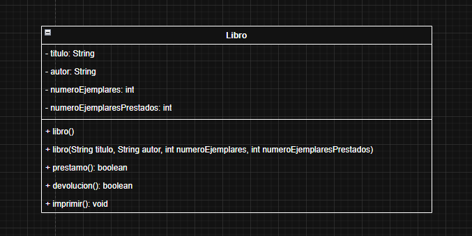

# Parcial1_ProgramamacionII

## Sebastián Andrés Abadía Sánchez
## Juan Sebastián Almendra Pechené

### Diagrama UML

#### Se trabajó en el equipo de la universidad y el git está configurado con el nombre de Andres Cabezas, por esa razón los commits salen con ese nombre, quien realmente hizo los commits es Sebastián Abadía

